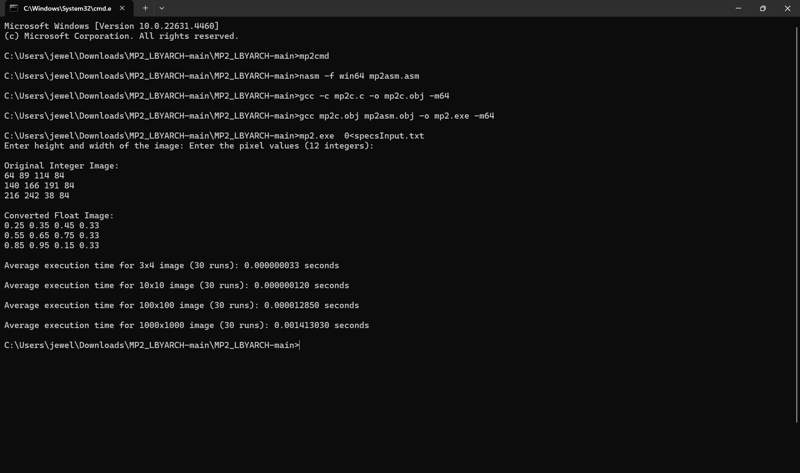

# Image Conversion from Int to Float Using C and x86 Assembly

## Execution Time and Performace Analysis
The program measures the execution time of converting an image from an integer-based to a floating-based representation. Multiple image sizes were tested, including 10x10, 100x100, and 1000x1000 pixel matrices. For each image size, the conversion process was repeated 30 times, and the average execution time was computed.

In analyzing the performance of each image size, smaller images such as the 10x10 matrix exhibited fast execution times. As the image size increases, the processing time increases slightly. However, the execution time remains efficient, especially due to the assembly language optimizations. The 100x100 matrix, while showing a noticeable increase in processing time compared to the 10x10 image, still processes quickly. As for the 1000x1000 matrix, the processing time increases marginally, but still reamins to be fast. The assembly language optimizations have a significant impact on reducing the processing time for larger images, making the assembly-enhanced implementation notably faster compared to a pure C implementation.

## Screenshot of the Program Output
Below is a screenshot of the program output, showing the original integer image, converted float image, and average execution times. The correctness check confirms that the conversion is accurate, with the integer values successfully mapped to floating-point values.

